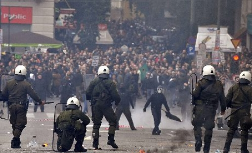

 BEYROUTH (Reuters) - Le président Bachar al Assad a décrété une amnistie générale en Syrie, annonce mardi la télévision publique, après dix semaines de manifestations contre son régime durement réprimées par l'armée. Selon la télévision syrienne, l'amnistie englobe tous les membres de mouvements politiques, y compris les Frères musulmans, interdits en Syrie. L'appartenance aux Frères musulmans, qui ont mené un soulèvement armé contre le père de Bachar al Assad, en 1982, est passible de la peine de mort. Des militants syriens ont affirmé que 10.000 personnes avaient été arrêtées depuis le début des manifestations contre Assad, dans la ville de Deraa, à la mi-mars, et qu'un millier de civils avaient été tués. (Courtoisie Reuters)

_Türkçe özet. Suriye devlet başkanı Beşir el Esat Salı günü genel af ilan etti. Suriye televizyonuna göre af,  1982 yılında o zamanki devlet başkanı Beşir el Esat’ın babasına karşı süikast girişiminde bulunan ve Suriye’de idam cezası ile yasaklanan “Müslüman Kardeşler” örgütü dahil tüm siyasi hareketlerin üyelerini kapsıyor._
