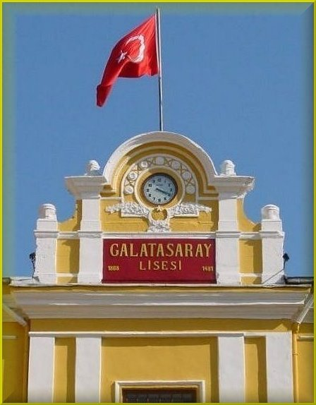

/\* Style Definitions \*/ table.MsoNormalTable {mso-style-name:"Normal Tablo"; mso-tstyle-rowband-size:0; mso-tstyle-colband-size:0; mso-style-noshow:yes; mso-style-parent:""; mso-padding-alt:0cm 5.4pt 0cm 5.4pt; mso-para-margin:0cm; mso-para-margin-bottom:.0001pt; mso-pagination:widow-orphan; font-size:10.0pt; font-family:"Times New Roman"; mso-ansi-language:#0400; mso-fareast-language:#0400; mso-bidi-language:#0400;}

(arşiv’den)

Pazar günü Galatasaray’ın pilavı vardı...Okulun  kurulduğu zamanlardan kalma eski gelenek, bu yıl yeniden yaşatıldı. Her sene haziran ayının ilk pazarında düzenlenen pilav günü, bu yıl yine Tanrı’nın lutfu güneşli ve serin bir havada yerine getirildi... Onbir yaşından seksen yaşına kadar en az sekiz nesil okulda toplandı...İhtiyarlar konferans salonunda, gençler avlularda, bahçelerde, ufaklar aralarda dolaşıyor...Erkekler kızlar... Sonradan evlenerek yuva kuranlar...Yanlarında yürüyen çocuklarıyle babalar... kucaklarında bebeleri ile anneler... torunlarıyla dedeler biler var...Oradan oraya koşuşarak sınıfları, koridorları çın çın öttüren yumurcaklar...Doğuştan Galatasaraylılar...gelecekte okuyacakları sınıfların tahtalarına daha şimdiden tebeşirle yazılar yazarak antraman yapıyorlar... Ev,okul, işyeri arasında geçecek uzun hayata başlıyorlar...  

Bahçede ilk Mehmet Ali Birant’ı gördüm... –Konferans salonuna gitmiyormusun ? dedim...-Aman boşver vırvır ediyorlar ...dedi...-İyi gelir hadi gidelim dedim... - Sen git...dedi. Yürüdüm... Salon dolu.  İnan  kıraç  kürsüde... -Vakfın parası yok...diyor. En sona oturdum.Yanımda bir koltuk boş... az sonra oraya gözlükçü Yüksel Toksoy oturdu...1949’ un eylül ayında Ortaköydeki binada, ilk akşam da yan yana oturmuştuk... 63 sene olmuş... –Ne çabuk geçti... dedim... -Evet hızlı gidiyor...dedi. Başını çevirip benden yana bakmamıştı...- Ne oluyor bu senelere ? dedim. –Bilmem, dedi... Anlaşılan konuşmak istemiyordu... Üstelemedim. Bazıları hatıra sevmez...Hele eskilerden söz etmeyi hiç sevmez... Bense bayılırım... sonra plaketler verildi...bekledik bekledik bize vermediler... mezuniyetin ellinci yılında vereceklermiş...Beş sene var. Bulurlarsa verirler...

\-Haydi yemekhaneye, dediler, salon dağıldı...Dönüş yolunda Kütüphaneye uğradım. Konya’da uzun yıllar kütüphanecilik yapmış değerli insan Celal Kişmir birkaç yıldır Galatasaray Lisesinin kütüphanesine bakıyor... Herkesten biyografi istiyor...Üçbin Galatasaraylı’nın biyografisini topladı... Millet pilav yerken o sessizce ilimle uğraşıyor...

Kütüphaneden çıkarken Ayhan Macarlıoğlu’ na rastladım... fişeğini bulmuş tüfek gibi oldum...Mubarek adam sanki o koridorda kırkbeş yıldır benim geçmemi bekliyor... İmdat  Herakles ! diyerek üzerine yürüdüm...Duvar kenarına sindi...Sanki radyasyona uğradı...Bu Ayhan Macarlıoğlu her dersi hiç çalışmadan bilir, hocasına anlatırdı...Hocalar hocalığı O’ndan öğrendiler...Bir gün Mösyö Coudert Ayhana bir şey sordu...O da söyledi...Coudert irkildi, bize baktı, penceren dışarı baktı...sonra tavana baktı, nihayet oturduğu kürsüden kalkarak cekedini ilikledi. Ayhanın önünde hürmetle eğildi... Coudert O’na ne sordu ? O ne söyledi, yıllarca kimse bilemedi...Ben de anlayamadım...Sormadım da, söylemezdi ki. Sonra o olay unutuldu...Biz dersleri Hocalardan değil Ayhan’dan öğrenirdik...Bu işin sırrını kimse çözemedi..

Sonraki yıllarda ben biraz anladım... Bize okulda eğitim diye okul genelinde yutturmaca öğretmişler...  Bildiklerimizi unutturmuşlar... kafalarımızı dağlamış, Gözlerimizi oyup kulaklarımızı tıkamışlar... Ayhan tuzağa düşmemiş... Hepsi bu kadar... Eğitimciler bunu sadece Galatasarayda değil dünyanın her yerinde, her okulda  yapmışlar... Daha da yapıyorlar... Eğitimin bir “ihtiyar diktatörlüğünden” başka bir şey olmadığını anlayacakları zamana kadar da sürdürecekler... Bir iki yüz yıl daha var... Bekleyin göreceksiniz...

Bütün bunlara rağmen beni Galatasaray’a yazdıran ailemin aziz hatırası önünde hörmetle eğilirim... Galatasarayda şimdi çoğu toprak olmuş bazı hocalarımın hatıraları önünde hörmetle eğilirim. Sistemi aşan  o hocalar ki, savaşta kumandan gibiydiler... Bizim cehlimizi yenmemiz için ne acaip sıkıntılara katlandılar... Galatasaray adama bilgiden çok ilgi verirdi...Herşeyle ilgilenir, Dünyaya adam gibi bakar, adam gibi oturur adam gibi kalkardık....

O değerli hocalar önce kişiliklerimizi yonttular... Sonra isteyen istediği şeyi oldu... Ama tam oldu... Asıl eğitim de işte tam buydu... Belki farkına varmıyorduk ama örs üstünde kızgın demir gibi eğilip bükülüyorduk... Bu sırrı da kimse çözemedi... Olsun ! böylesine sırlar çözümsüz kalsın. Varlıklarıdır bize hayat veren... Cümle Galatasaraylılar Pilavınız kutlu olsun..Seneye buluşuruz... (Arşiv’den )   

(Güncel) 

Aynı konuda 6 yıl önce yazdığım bir yazıyı tazeleyip getirdim. Yazı yedi yıl sonra güncelliğini kaybetmedi. Galatasaray Lisesi’nin pilavları hiç değişmeden sürüyor. Hiçbir yenilik getirmiyor, hep konuşmalar… hep nutuklar… Mehmet Ali’nin dediği gibi “vırvır da vırvır”.. insanın boğulacağı geliyor. O çıkıyor, bu çıkıyor hep yaptıklarını anlatıyor, yapmadıklarını ,yapamadıklarını anlatan yok. Halbuki asıl önemli onlar..  İnsana yaptığını değil yapamadığını sorarlar değil mi efendim ? Halbuki ne güzel şeyler olabilirdi, küçük animasyonlar, skeçkler sergiler, konserler daha neler neler ama bunlara sıra gelmiyor ki.. veya akıl erdiren çıkmıyor..

Galatasaraylılar:   bu yıl “eşek ziya” ve “moruk doğan” rahmetli oldu, gelecek pilavlarda eksiksiz buluşalım.
