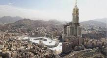

(Arşiv'den ilk yayınlanma 18 Kasım 2006)

 ** Müslümanlığın**  bu şekli **utanç** vericidir. Eğer buna **Müslümanlık** deniyorsa ben **Müslüman** değilim. **Müslüman**‘ın bir **Kâbe**’si vardır. Bir **Kıble**’si vardır, Bir **mihrabı** vardır. Bir **yaşam** biçimi vardır. Milyonla **doları** olmasa da **garip** ve **hüzünlü** bir kalbi vardır.

**Müslüman,** çağın yaşanan **rezilliklerinden** rahatsız olur. **Müslüman,** Dünyada en son **aç doymadan**, kendisi doymaz. Müslüman, dünyada en son **çıplak giyinmeden** kendisi giyinmez. Dünyada en son huzursuz **huzur bulmadan** Müslüman **rahata** eremez… Bu **din** bin beş yüz yıl önce dünyaya gelmiş, **dinlerin** sonuncusu, teslim, **tevhid** ve mutlak Yaradan'ın huzurunda **tevazu** dinidir. Kalp **çırpıntılarının** en muhteşemi, **yaşam biçimlerinin** en ulusu, Ruhsal **sistemlerin** en şereflisidir. **Tanr**ı’dan insanlara  son Peygamberi ile son **hitab-ı izzetidir**. 

Hal böyleyken bazıları **Kabe-i Muazzama**‘nın yanına muazzam bir **kule** dikmişler. Adını **“zemzem tower”** koymuşlar, şimdi birtakım yılışık **zenginler** bu kuleden **daireler** alıp, pencere kenarına çöküp Müslümanların **Kâbe’**sine karşı kıllı bacaklarını uzatıp **keyif** çatacaklar. Çaylarını **yudumlayacaklar**, dostlarını **misafir** edecekler, aşağıda   **hacı adayları** kaynaşırken bunlar yukarda **bulutlara** yakın bir yerde **uzun** oturacaklar. Hay adınız **batsın**…

**Osmanlı** mukaddes topraklara ve **“beytullah”**a altı asır sahip çıktı **Kabe’**nin yanına ondan yüksek **bina** yapmadı. Bu ne **rezilliktir**. Destur, Bu nasıl **Müslümanlık** ?

**Kabe**‘nin yanında yükselecek **“bilmemne**” kulesinin sekenesi **def-i hacette** bulunurken acaba yüzlerini hangi **istikamete** çevirecekler ? **İslâm** terbiyesinin asırlarca en koyu yaşandığı **makarr-ı Hilâfet İstanbul şehrinde**, eskiden yapılan evlerde **ayakyolu** hiçbir devirde **Kıble** yönüne bakmadı. Son **örnekleri** zar zor ayakta durmaya çalışan eski **İstanbul** ahşap evlerinin    **dikkat** ediniz, hiç birinin tuvaleti   **Mekke** yönünde değildir. Bu **medeniyetin** kurucuları şimdi gidip **Mekke’**de **Kabe**‘ye karşı kule yapıp içine **apteshane** koyuyorlar, acaba o **apteshane** nereye bakıyor…? Ruhları **apteshane** olmuş **bahtsızların**…

**Kabe**‘ye karşı kule yapanların kulesi inşallah **“ruz-u mahşerde**” onbir eylül kuleleri gibi **“ground zero”**olacak. **Rabbimden** istediğim bu… Benim adımı **terörist** koyun…Tekrar ediyorum.   Siz buna **Müslümanlık** diyorsanız,   ben **Müslüman** değilim.  

Bunlar **Müslüman** değil, **Fahri Kainat’ın** adını kullanan, **Mevlânâ**‘nın deyişiyle bir alay samsalak **tezek** tüccarıdır. **Hayta kılıklı** yüzsüz **bezirgandır**. Kese **zengini**, ruh **fukarâsı**   donguz dangalak **tayfası’**dir.**.** Milletin parasını çalıp gece **klüplerinde** yiyen **sergerde** takımıdır. **Kâbe**‘yi **Suudî’**lerin gece **klübü** zannettiler. Böyle **Müslüman** olamaz… Ey  zamanzede **“kara para”** hacıları…

Bir zaman, bir **adam**, bir şeyhe **para** getirmiş. Şeyh **müritlerine** demiş ki :” şu parayla **saman** alın, getirip ahırdaki **eşeğin** önüne koyun” **Müritler** söyleneni yapmışlar, **eşek**   önüne gelen **samanı** yememiş. Şeyh, **para getiren** adama dönmüş - **gördün mü bak**… ? senin paranla alınan **samanı** bizim **eşek** bile yemedi…” demiş.

Kara para ile **saman** alsanız **eşekler** yemez, siz o paralarla  **Mekke**‘de “**devre mülk**” aldınız… Ama **insaf** ile hükmedilsin…Tabii ki **allahüâlem** hepinizin parası bu kadar **kara** değildir, ancak **Kuleye** çıkıp **Kabe**‘ye karşı  çöğdürenin **kalb**i, o paradan da karadır… **Emin olabilirsiniz… (**Arşiv'den)
