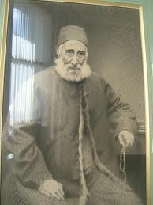
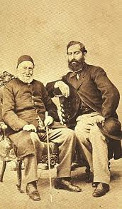

 [ George Soros](../uploads/2011/10/soros.jpg "soros.jpg") (Arşiv'den)

/\* Style Definitions \*/ table.MsoNormalTable {mso-style-name:"Normal Tablo"; mso-tstyle-rowband-size:0; mso-tstyle-colband-size:0; mso-style-noshow:yes; mso-style-parent:""; mso-padding-alt:0cm 5.4pt 0cm 5.4pt; mso-para-margin:0cm; mso-para-margin-bottom:.0001pt; mso-pagination:widow-orphan; font-size:10.0pt; font-family:"Times New Roman"; mso-ansi-language:#0400; mso-fareast-language:#0400; mso-bidi-language:#0400;} 6.9 milyar dolarlık servetiyle dünyanın 37. zengini olan Banker Soros’u bir Fransız mahkemesi 2.2 milyon euro para cezasına mahkum etti... 14 yıldır süren mahkeme sonucunda cezaya çarptırılan 72 yaşındaki Banker’în suçu hissedarlarına yasa dışı yollardan para kazandırmak... Veya buna benzer bir şey.

Ben iktisatçı değilim. Verilen haberleri anlamıyorum...Zaten iktisatçılar bile anlamıyor... Bu derecede yüksek suçlar ve böylesine siyaset kokulu mahkemelerde neler olduğu pek anlaşılmaz... Bunlar genellikle hamamın namusunu kurtarma adına açılıp yürütüldüğü için hamamın diğer müşterileri rahatsız olup kaçmasınlar diye kasten karanlıkta bırakılır...

Kimsenin anlamadığı, düşünüp çözemediği hukuki değimler, ekonomik açmazlar özellikle bulunur, iş sislere büründürülür ve belki de erbabına gizli mesajlar sarkıtılarak onların da zamanında önlem almalarına yol açılır. Dünyanın şeytanlarının bu ve buna benzer ne numaraları vardır... Halklar bu numaraları yutarlar...

Emekliye ayrılıp işleri oğlu Robert’e bırakan  George Soros’ u uzun zamandır merak ederim... Bu adamın adı, Kemal Derviş’in arabasında açık unuttuğu not defterinde tesadüfen görüldüğünden beri aklım ona takılmıştır... Nerede adı duyulsa, nereden başını uzatsa hemen ilgimi çeker... Birkaç ay önce BBC’de bir programda kendisine dediler ki : – Dünya batıyor, insanlık namına kime rüşvet verdiyseniz açıklayın... İhtiyar Soros imana geldi ve birkaç sır verdi... Bunların arasında Nigerya’nın bütün petrol gelirini yürütüp İsviçre’de bankaya yatıran iki zenci’nin de adı vardı... Her ikisi de İngiliz Oxfort üniversitesi mezunuydu.

_**Salomon Camondo**_ (1781 – 1873).

İstanbul’da, Beyoğlu’nda, Tunel’i sağda, Şeyh Galib’in türbesini solda bırakıp Yüksek Kaldırımdan aşağı doğru inerseniz, Bir sokağın köşesinden Galata Kulesini görünce solunuza bakın. Burada kale gibi dev bir apartıman göreceksiniz, duvarları kararmış, pencereleri kırık, kapıları yıkık, içi harabe... Damında ağaçlar yetişmiş... Bu yapı Galata Bankerlerinin en ünlülerinden Kamondo ailesine aittir. Aile Paris’e göçtüğünden beri doksan yıldır burada kimse oturmuyor...

Kamondo ailesi, Osmanlı’yı batıran Galata Bankerlerinin başını çeker... Dolmabahçe Sarayı yapılırken Sultan Mecid yönetiminin bu Bankere 4 milyon altın sikke borcu vardı... Paşalar Padişaha yalvarmışlar... – Hünkârımız, Devlet çok zor durumda, parayla para satın alamayız... Günahtır, İslama aykırıdır, bu işten vaz geçin... Padişah’ın cevabı kesin olmuş – Çoluk çocuğum açıkta mı kalsın...? Bu saray yapılacaktır... Ve Kamondo vermiş yeniden paraları... Kamondolar ayrıca savaşları da finanse ederlermiş, Kırım Savaşı, Balkan savaşı, Trablusgarp harbi gibi... İşin bu noktası savaş tarihçilerini ilgilendiriyor...

Kamondo ailesinden bu gün hayatta olan kimler vardır ? bilinmez... Herhalde Batı finans kapital dünyasında henüz isimleri anılmaktadır. Kamondo ailesinin ilki Büyükbaba Abraham Salomon 1873 yılında Paris’te ölmüştü. Cenazesi vasiyeti üzerine İstanbul’a getirildi ve 14 nisan 1873’te muhteşem bir devlet merasimi ile Feriköy Musevi Mezarlığına gömüldü...

/\* Style Definitions \*/ table.MsoNormalTable {mso-style-name:"Normal Tablo"; mso-tstyle-rowband-size:0; mso-tstyle-colband-size:0; mso-style-noshow:yes; mso-style-parent:""; mso-padding-alt:0cm 5.4pt 0cm 5.4pt; mso-para-margin:0cm; mso-para-margin-bottom:.0001pt; mso-pagination:widow-orphan; font-size:10.0pt; font-family:"Times New Roman"; mso-ansi-language:#0400; mso-fareast-language:#0400; mso-bidi-language:#0400;} Bilerek veya bilmeyerek, zorunlu biçimde, ekonomik veya siyasi tutum takınarak, yahut günün koşullarından ayrılma yeteneğine sahip olamayarak  koca bir imparatorluğu batıranların arasında bulunan Banker Komando’larla, 72 yaşındaki Banker George Soros arasında garip bir benzerlik seziliyor... Bunlar işlerin kötüye gittiğini anlasalar bile girdikleri yoldan geri dönmüyorlar...

Soros hakkında Batıda yazılanlar oldukçe geniş yekün tutar. Diyorlar ki : “Soros devletleri batırır, devletleri kurtarır... Acımasızdır... Paranın peygamberidir... Batı sermaye piyasası onun elindedir, İngiliz lirası onundur... Fransız frangı, Alman markı, italyan lireti de ondan sorulurdu şimdi euro’ya karışıyor...” Banker Kamondo ailesi hakkında çok değerli bir kitap ortaya koyan Nora Şeni ve Sophie le Tarnec isimli yazarlar eserlerine bir “hanedanın çöküşü” adını vermişlerdi. Kamondoların zamanında bir “hanedan olduğu” bu eserde açıkça görülmektedir.  (İletişim yay. İstanbul 1997)

Şimdiki Soros,ailesi de bir hanedandır... Soros’un 6.7 milyar doları varmış... Bilmem Kamondoların o kadar paraları var mıydı ? Yedi iklime hükmetmiş koca bir padişaha saray yaptıracak servet, belki de Soros’un milyarlarına eşitti...Ben merak ediyorum: Osmanlıya Kamondo musallattı... Cumhuriyete de George Soros musallat olmuş... İMF’nin arkasındakilerden biri de O... Acaba Kamondo koca padişahlığı sarsarken bu topraklarda yaşayanlara acımadıysa, Soros şimdi bizlere acır mı ? Banker sülbünden geldiğine göre emri hak vukuunda ona da Devlet merasimi yaparlar mı ? Yok...O ülkesi Macaristan’a gömülür...(Arşiv'den)

                                         

                        Salomon Camondo ve oğlu Nessim
