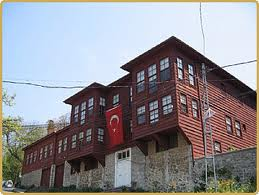

Üsküdar’da onarılmakta olan Özbekler tekkesi soyuldu. 9 ekim Pazar günü belirsiz bir saatte Tekke’nin mesçidinin demir parmaklıklarını kıran menhus eller, içeriye duhul ederek vakıflar idaresi tarafından bakımı yapılarak korunmaya alınmış olan 300’e yakın paha biçilmez tarihi eser arasında kendilerine yarayan bazı eserleri alıp götürdüler. Kolluk kuvvetleri şu saatlerde Dergahta inceleme yapıyor. Bu haberle ilgili ayrıntılar geldikçe yazacağım. (N.U.Üsküdar-Bağlarbaşı, 9 ekim 2011. Saat: 21.35)

\*İlk aldığım bilgilere göre "Sakalı Şerif" Şeyh Ethem Efendi'nin "Pergeli" ve ebruları yerinde duruyor.(saat:11.30)

\*Tezhipli berat ve fermanlar ve Kuranı kerim cüzleri kayıp.. Hırsızların sadece tezhipli belge aradıkları anlaşılıyor. . Polis ben dahil Tekkeye gelip giden herkesin nufus kağıdını istedi. (1o ekim 2011, saat:13.00)

\*Haber Cumhurbaşkanlığı Genel Sekreterliğine ulaştırıldı. (Saat: 13.30)

\*Haber yurt içinde ve yurt dışında legal antika ticareti yapan kuruluşlara ve kolleksiyonerlere ulaştırıldı.(Saat:16.30)

\*11 ekim tarihli Haber Türk gazetesinde manşet: "tekkeyi bile soydular" Turhan Arslanoğlu ve Hüseyin Şentürk'ün yazısı. "Hırsızlar Sakalı Şerif'in değerini anlamadılar, iki yazma Kuranı kerim kayıp"

\*Cumhurbaşkanlığı Genel Sekreteri Mustafa İsen'le görüşüldü. Cumhurbaşkanı'na konunun iletildiği belirlendi.  Genel Sekreter İstanbul valisine tel. etti. (11 ekim 2011,saat 11.30)

\*Paris'te Kutsi Erguner ve Londra'da Robert Brown ve Dick Temple ile görüşüldü. Christie's ve Sotheby's gibi dünyaca ünlü müzayede şirketlerinin dikkatleri çekildi. (12 ek,Saat: 04.20)

\*geçen günler içinde çalınan eserlerden geri kalan parçaların tamamı Vakıfların daha güvenli bir müzesine nakledilerek ikinci def korumaya alındı. Müzenin adını gizli tutuyorum. ( 25 ekim 2011, saat:18.25)
