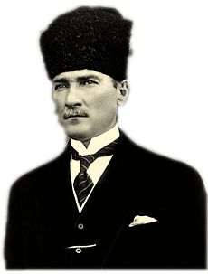
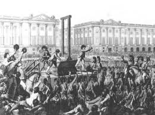
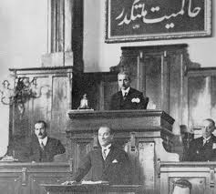
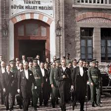

/\* Style Definitions \*/ table.MsoNormalTable {mso-style-name:"Normal Tablo"; mso-tstyle-rowband-size:0; mso-tstyle-colband-size:0; mso-style-noshow:yes; mso-style-parent:""; mso-padding-alt:0cm 5.4pt 0cm 5.4pt; mso-para-margin:0cm; mso-para-margin-bottom:.0001pt; mso-pagination:widow-orphan; font-size:10.0pt; font-family:"Times New Roman"; mso-ansi-language:#0400; mso-fareast-language:#0400; mso-bidi-language:#0400;}

**(Arşiv'den)**

Yakın zaman Türk siyasal yaşamının Osmanlıdan Cumhuriyete geçişi bu yıl 79. yılını kutluyor...Gelecek sene seksen olacak...Ortaasya çıkışlı Türk Ulusu 80 yıldır Cumhuriyet adını taşıyan bir yönetim biçimi altında... Aslında bu şekil bir Batı geleneğidir....Doğu toplumlarında insanlar güvendikleri bir şefin ve sülbünün etrafında toplanarak o ne derse onu yaparlar...Cumhuriyet ise yaşamla ilgili siyasal kararların tüm ulusun birleşmesiyle verildiği bir  yönetim biçimidir. Bu Yönetimde bir de parlemento var...Yani ulusun seçtiği temsilciler bir yerde toplanıp konuşacak.... Bu da Kuzeyde denizlerde yaşayan Viking’lerin icadıdır...

Eskiden dünyada kral ve soylulardan oluşan diyet meclisleri vardı...Orta Asya’da hükümdar ve kurultaylar... Cumhuriyetler, Kralların ve İmparatorların karar ve yaptırım gücü azalarak, halkların gücü öne geçtiğinde kuruldu... Bu bir siyasal rüşt ispatıdır... Önce Tanrı-Kral, sonra Kral, sonra da Halk ve meclisi... şimdi o noktadayız...Yani gelişen ve siyasal kudretini ispat eden “halkın” fiilen yönetime el koyması...

Bu sosyolojik tarihsel gelişme, kolay olmamıştır.En ileri örnek 1789 Fransız Devrimi... Fransızlar, özellikle Marsilya’ dan gelen bir kısım öfkeli insanlar, Paris’te krallarını devirip hep birlikte tahta kendileri oturdular... Yaptıkları işe de “Cumhuriyet” adını koydular... Pek çok da adam öldürdüler... İhtilalin babalarından Saint Juste, Halk meclisinde ağır bir direnişle karşı karşıya kalınca :“ondört yüzyılın pisliğini, başka türlü temizleyemem, babamı bile giyotine gönderirim...” dedi.

1789 Fransız devrimcileri, halk iradesine akıl erdiremeyenleri her sabah saman arabalarıyla giyotine gönderirlerdi. Günde 2000 kişinin kafasını kestiler.. Madam Tussault kesik kafaları mumyalayıp müze kurdu. Sonra korkup İngitere'ye kaçtı.

Cumhuriyet halk egemenliğidir. Halkın kendi kendine sahip çıkışıdır. Bunun teknik yaptırım aracı da “demokrasi”dir. Şimdilerde ekonomisi de gelişerek çeşitli aşamalardan sonra “serbest ticaret” oldu. Ancak“demokrasiler ve Cumhuriyetler henüz serbest ticareti “eşkiyalıktan” kurtaramıyorlar...Belki bir gün ona da güçleri yetecektir... ,

Halk iradesi kavramının gelişmesi ülkemizde de kolay olmamıştır... İstanbul’da Bir buçuk asır önce  “Mizan:Terazi”isimli bir gazete çıkaran Sultan Aziz devri aydınlarından “Mizancı Murat bey” için Milli İrade ve parlemento sistemi “ümmül habais” Yani “kötülükler anası” dır. Murat bey için bir ülkeye yapılacak en büyük fenalık, o ülkeyi Fransızlar gibi halkın iradesine ve idaresine bırakmaktır...O çağda halk pek “aşşağılık” görüldüğü için, sadece Murat bey değil, devrin önde gelen tüm aydınları “yakinen izledikleri Fransız ihtilalinden beri devlet, sokaklarda koşuşan serserilere teslim edilir mi ?...” düşüncesindedir. Devleti asiller, soylular, zenginler ve hocalar yönetecek...Halk onlara uyacak...

Ulusal kaderimizin  şu muhteşem cilvesine bakınız ki, o tarihten yaklaşık altmış yıl sonra Osmanlı yıkılmış, tüm kurumları ile tarihe gömülmüş, Ankara’da halk egemenliği ve Parlemento kurulmuş ve üzerine “Hakimiyet kayıtsız şartsız milletindir” yazılmıştır.  Acaba Murat bey o yazıyı görseydi ne şekle girerdi ?...Halkın bir gün devletini, soyluların elinden alacağına hiç de inanmamıştı Murat bey...Şimdi de bazılarının “soysuz”lardan kurtulamayacaklarını sandıkları gibi...  

Seksen yıllık Cumhuriyetimiz , Asya’dan kalma “tek şef ve hanedan çevresinde “toplanma geleneğinin kırılışıdır...Toplumun rüştünün ispatıdır...Bu gerçek, 29 ekim 1923’te akşam saat 18.45’ te toplanan Büyük Millet Meclisinde okunan,Anayasa Komisyonu tutanağında şöyle dile getirilmişti : “Ulusumuzu esenliğe ve mutluluğa ulaştıran ve tam bağımsızlığa kavuşturan ,Tanrının da beğendiği, kutsal mücadelede, ulusal egemenlik temeli kesinlikle kabul edilmiş ve hep buna uyula gelmiştir.Bu usulün soylu ulusumuza ve şartsız ulusa ait olması ve idare usulünün ulusal kaderin ulusça yönetilmesi temeline dayalı bulunması Cumhuriyet demek olduğundan kişisel saltanatı kesinlikle kovucu olan bu kelimenin kullanılması ve Türkiye Devletinin hükümet şeklinin cumhuriyet gibi olması  hakkındaki Anayasa maddesinin bir fıkra ile açıklanması hukuka ve işin gereğine uygun görülmüştür.”

Cumhuriyetin ilk işareti 21-22 haziran 1919’da Mustafa Kemal Paşa tarafından Amasya tamiminde şöyle dile getirilmişti: “ Milletin istiklalini yine milletin azim ve kararı kurtaracaktır...” Ve Paşa daha sonra Nutukta şunları söylemişti: “ hükümet milli egemenlik esasına dayalı halk hükümetidir. Cumhuriyettir..”

Seksen yıl önce Ankara’da kurulan “Cumhuriyet” ulusumuzun hakkıdır. Ve Cumhuriyet giderek gelişmesinin doruklarına varmış her ulusun hakkıdır... Diktatörlük bunun tersi... Halkların kötü kaderi... Neye yarar ki, Roma’yı yıkan tiranların kahrolası kuyrukları hâlâ yaşlı dünyada varlık savaşı veriyorlar... Cumhuriyet bayramınız kutlu olsun... Dünyadaki tüm tiranların tamamen silinip yok olacağı günleri beklerken övgülerimiz, şu Cumhuriyeti kuran Gazi Mustafa Kemal Paşa ve çevresindeki erdemli vatandaşlaradır. Örnek insanlarmış. (Arşiv'den)
