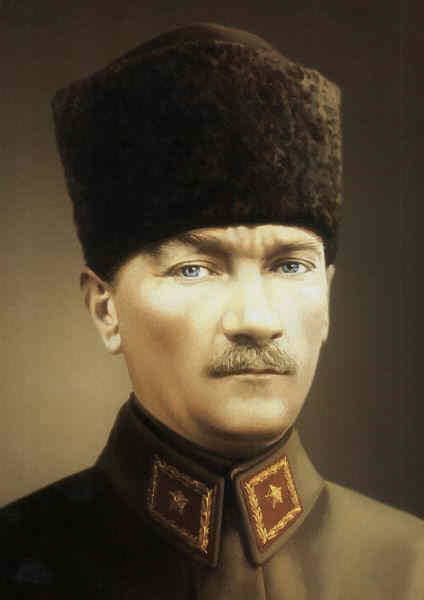

****

 **(arşiv'den)** 

**En yakın arkadaşı İsmet İnönü Atatürkü şöyle anlatıyor: “Atatürkün genç zabitliğinde bilmediğimiz,meydana çıkmamış vasıfları büyük vazifeler karşısında bulundukça kendini göstermiştir. Büyük hassaları vardır. Karar sahibidir, kararları açıktır. Ve bir defa karar verdikten sonra onu tatbik ettirmek için şahsiyeti çok tesirlidir. Mesela kumandanlıkta bu hassası bilhassa dikkat çeker.**

Muharebe meydanında yürütmek istediği muharebe şeklini,tertipleri en uzak yerde bulunan askere kadar duyurur,onun üzerinde kendi iradesini ve azmini behemahal sirayet ettirir. Bu, bir kumandan için en büyük hasletlerden biridir.Askerlik vasıfları hakikaten yüksektir. Her millette,her devirde yüksek vasıfta kumandan sayılır. Siyasi vasıflarının daha yüksek olduğu görülmüştür. Bu ikisi birleşince Atatürk’ün şahsiyeti müstesna bir ölçüye çıkmış oluyor.

Siyasi vasıfları hakikaten çok yüksektir. Milli Mücadelenin askeri safhada idaresi kadar siyasi idaresi de naziktir Hatta daha nazikti denilebilir. Atatürk siyasi safhanın idaresinde de aynı derecede maharetli, daha maharetli olmuştur. Mesela benim kannatimce Milli Mücadelenin bir millet meclisi kurularak onunla beraber yürütülmesi son derecede güç,fakat harikulade isabetli bir karar olmuştur.

Padişah idaresi ,saltanat idaresi bütün tarihten gelen mekanizma hayati bir mücadelede karşı tarafta bulunuyor... Bunun karşısında Büyük Millet Meclisi kurulabiliyor ve Millet Meclisinde ihtilalciler bir hükümet teşkil ederek mücadeleyi devam ettirebiliyorlar. Askeri sahada, iç ve dış siyaset sahasında bu, harikulade bir buluştur. Emsali de hemen hemen yok gibidir. Zannediyorum anlattığım meziyetlerden sadece bir tanesi bir insanın hayatını dolduracak kuvvette ve ehemmiyettedir.”  Kaynak: İnönü Atatürkü anlatıyor. Abdi İpekçi, Cem Yaynevi İst. 1968 Shf. 35) 

Bir başka yakın arkadaşı, Rauf Orbay da O’nu şöyle anlatıyor: “Mustafa Kemal Paşa telgraf makinesi başında bir dakika içinde askerlikten istifa ve Padişahça da askerlikten uzaklaştırılmış olarak her türlü sıfat ve yetkilerinden bir anda sıyrılmış,fakat gerçekte yine o anda,değme millet ferdinin, hatta o zamanki hükümdar ve hükümetin dahi mazhar olamayacağı itibar, şeref ve kudret ile, en yüksek mertebeye ulaşmış bulunuyordu.

Mustafa Kemal Paşa sayısız meziyetleri, hasletleri ile istihkak ederek ulaştığı bu “Milli Mücadele önderliği” mertebesini yeryüzünde misli görülmemiş derecede çetin şartlarla savaşmayı gerektiren bu mücadeleyi,şan ve şerefle sona erdirerek,aziz vatanı kurtarıncaya kadar hakkıyla muhafaza eyleyerek kendisine inanmış olanların hepsini, bütün bir milleti şad etmiştir. Başından sonuna kadar, mücadelenin içinde bulunmuş bir insan olarak bütün samimiyetimle tarih huzurunda itiraf ederim ki; o olmasaydı bu vatan ve bu millet,bu kurtuluşu,böylesine tam ve şan ve şerefle ,kolay kolay idrak edemezdi.

 Bu gerçeği itiraf ederken, Mustafa Kemal Paşa’ nın, bütün sıfat ve yetkilerinden sıyrılıp bir millet ferdi haline geldiği zaman, “önderimiz ancak o olabilir” diye O’nu Padişah’a, hükümete ve düşmanlarının tazyıkına rağmen, kendi yetkileriyle techiz ile baş tacı edip emrine girmek suretiyle vatanseverlik, fedakarlık ve nefis feragatini göstermiş olan Kazım Karabekir ve Ali Fuat Paşa’ların  kurtuluş davasındaki hassasiyetlerini de unutmak büyük nankörlük olur...” (Kaynak:Rauf Orbay’ ın hatıraları,Yakın Tarihimiz, Cilt 3.Shf 52.)  

Bu gün Mustafa Kermal Paşa’nın ölüm yıldönümü...64 yıl önce fani hayatına son veren Atatürk, yerine koskoca bir ülke ve sağlam bir rejim bırakmıştır...Devrine onunla birlikte yaşayan pek çok dünya liderinin kurduğu düzen bozulmuş, O’nunki sağlam kalmıştır... Nazi Almanyası ve Stalin Rusya’sından yeryüzünde eser yoktur... Ama Atatürk ve arkadaşları aracılığıyle Türkiyede kurulan Cumhuriyet  rejimi, uzun bir maziye dayanan temelleriyle ayaktadır... Osmanlıdan başlayan bu temeller,gün ışığına çıkarak yeni, modern ve çağdaş bir devlete dayanak olabilmek için en az iki yüz yıl liderini aramıştır...

Atatürkü anlamak çağı anlamak ve geleceğe ışık tutmak anlamını taşıyor...Türkiyenin tek şansı budur. Her yıl anma törenleri yapılıyor...Bu törenler İnönünün değimi ile “ebedi şef”in temel direktiflerini hatırlamaya yarayacaksa çok şey kazanacağız... aksi halde resmini duvara asıp önünde tapınmakla geçen yıllara yazık olacaktır.(arşivden)
