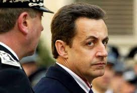

La proposition de Nicolas Sarkozy de venir en Italie pour soutenir le très probable futur chef du gouvernement, Mario Monti, a été très mal perçue par la presse et par certains hommes politiques transalpins. Comme l'a révélé le blog Elysée, Côté Jardin,

le président français a proposé à son homologue italien, Giorgio Napolitano, de se rendre à Rome avec Angela Merkel dès la formation du nouveau gouvernement pour soutenir Mario Monti. Il a également proposé de prendre si nécessaire des contacts avec les responsables politiques italiens pour garantir à M. Monti la majorité pour former un gouvernement durable.

Massimo Polledri, député de la Ligue du nord, s'est insurgé contre cette idée, samedi, en prenant la parole en français à la Chambre des députés. Invitée à s'exprimer en italien, il a poursuivi dans sa langue natale sa harangue contre "le directoire franco-allemand" qui s'apprête à "prendre le pouvoir".

La presse n'a pas été plus tendre. "Quelle humiliation de se faire commander par Sarko", s'insurge par exemple Il Giornale. Sarkozy, s'il vous plait, restez chez vous", demande pour sa part le Corriere della Sera, qui évoque "le complexe de supériorité (non fondé)" du chef de l'Etat français. (Courtoisie Le Monde 12,11,2011)

_Türkçe özet: Fransız cumhurbaşkanı Nikola Sarkozy’nin Angela Merkel’le birlikte yeni kurulacak İtalyan hükümetine destek vermek için Roma’ya gelme fikri İtalyanları kızdırdı._

_Parlemento'da konuşan “Kuzey Birliği”nden milletvekili Massimo Polledri “Fransız-Alman kanadı  iktidar almaya hazırlanıyor" dedi. “İl Giornale” gazetesi “Sarko’dan emir almak ne kadar aşağılatıcı..” diye yazdı. Corriera della Serra gazetesi ise "Sarkozy lütfen evinde otur" dediği Fransız devlet başkanı'nın “üstünlük kompleksine” işaret ediyor.  (Teşekkürler le Monde)_
