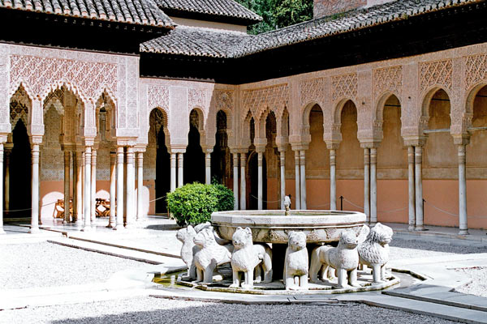

  (Tarihten ibretli kesitler)

**Kuzey’in baronları** ile yaptığı savaştan dönen son **Nâsırî hükümdarı**’nı halk çılgınca alkışlıyor, **zafer** çığlıkları atıyordu. Az sonra **Granada Sarayı**’nda müzakereler başladı. Halk **basit bir barış** anlaşması imzalanacak zannediyordu. **Taraflar** kimseye haber sızdırmıyorlardı.

 **Granada**’lılar gerçeği **Kardinal Jimenez** bir sabah **Elhamra Sarayı**’nın üzerine haç’ı diktiğinde anladılar. Çok ağlayıp **döğündüler** ama iş işten geçmiş, **800 yıllık İslam toprağı** Endülüs, sonsuza dek ellerinden gitmişti.

**İspanya**’daki son Nâsırî hükümdarı **Baobdil** lakaplı **13\. Abdurrahman** o gün çoluk çocuğu ile **Elhamra Sarayı**’nı terk etti. **Saray**’dan çıkan kafile karşıki tepelere varınca devrik **hükümdar** geri dönerek **sarayına** son bir kez daha baktı ve derin bir “**ahh..**”” çekti, o **tepe** bu gün dahi “**Ultima suspiro della Moro**: Arabın son ahı tepesi” adını taşımaktadır.
