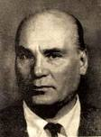
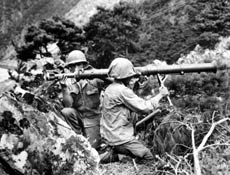
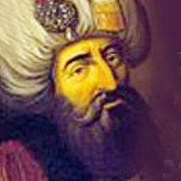

 (Arşiv'den)

Türkiye ve Türkler hakkında yabancı devletlerin düşüncelerini biz Türk halkına hiç bir zaman söylememişizdir. Ne yazarlarımız, ne çizerlerimiz ne liderlerimiz, ne de devlet adamlarımnız bu konuda hiçbir ip ucu vermemişlerdir. Herşeyin güllük gülistanlık, herkesin Türk dostu ve yeryüzünde yaşayan her kavmin Türke hayran olduğunu yıllar boyu anlatmışlardır.

Bu gelenek basında benim bildiğim zamanlarda tüm şiddeti ile sürüyordu. Kore savaşı biteli iki yıl olmuştu. O sırada ben onyedi yaşındaydım. Gazetecilik heveslisi pırpır bir gençtim. Bir gün ünlü yokuşu tırmanırken zamanın meşhur gazetecisi Hikmet Feridun Es ile karşılaştım. Bu zat yeni kurulan ve sansasyon arayan Hürriyet gazetesinin savaş muhabiriydi. Kore savaşını izlemiş Türk okuyucusuna harikulade savaş hikayeleri, efsane kahramanlıklar ve fantasmalarla dolu bir Uzakdoğu resmi sunmuştu. Dünyalar benim olmuştu. Tanıştık ve sonraki yıllarda pek sık görüştük.

Hikmet Feridıun bey daha sonra uzun yıllar yayınlanan ve devrinde Türkiye’nin en modern aylık mecmuası olan “Hayat Dergisi”nin başına getirilmişti. Ben de o dergiye yazılar yazıyordum. Bir gün yazı işlerinde otururken kendisine sordum: “Feridun bey Kunuri savaşı ile ilgili anlattığınız hikayeler doğru muydu ? ” Bu savaşı Türk okuyucusuna Kanuni’nin Mohaç zaferi gibi anlatan Feridun bey güldü.. Başını çevirdi, yavaş bir sesle” herşeyi karıştırma… dedi.

Kore savaşının en büyük faciasının yaşandığı Kunuri katliamı hakkında tarihin hükmü şöyledir : “30 Kasım 1950 günü tugayımızın yarısından çoğu kaybedilmişti. Bu çetin mücadelede kahraman Türk askerleri saatlerce süren süngü savaşı sonrasında şehit düşerken, geride bulunan diğer Birleşmiş Milletler birlikleri silahlarını ve teçhizatını bırakarak da olsa kurtulabilmişti. Amerikan karargahı sonradan kendilerinde de yeterli bilgi olmadığı için Türklere bilgi veremediğini açıklayarak işi kapatmıştı.

Amerikalılar, hava koşulları, arazi ve Türklerle aralarındaki dil sorununun yol açtığı anlaşmazlıklar yüzünden Kunuri Savaşının bir bozguna dönüştüğünü, özellikle Türkler için çok kanlı ve trajik bir şekilde sonuçlandığını söylemişlerdir. Sadece bir-iki gece süren Kunuri Savaşında Türk Tugayı 741 şehit, 2068 yaralı, 163 kayıp, 244 esir ve 298 diğer olmak üzere toplam 3514 kayıp vermiştir.”

Değerli büyüğüm, ağabeyim, gazetecilikte ustam Hikmet Feridun Es’in büyük kahramanlık hikayeleri ile Türk okuyucusuna zerkettiği Kunuri savaşının, Amerikalıların Türkçe bilmemeleri ve Türklerin de onların ne dediğini anlamamaları yüzünden Ordumuza 3500 can kaybına neden olduğunu, böylece değerli okuıyucularımız aradan geçen 60 yıl sonra bu gün, şu saate, şu naçiz kalemimizden öğrenmektedirler.

Osmanlı Ordularının 11 eylül 1697 ‘de Avusturya ordusu ve prens Eugenie'nin önünde yaşadığı  büyük Zente bozgununda Sadrazam Elmas Mehmet paşa ile Temeşvar muhafızı Koca Cafer Paşa’nın “araziyi bilmemeleri dolayısıyle 30 bin şehit verdiğini tarih yazıyor. Aradan geçen 263 yıl sonra “yine araziyi” bilmeyen ve bu defa dil de bilmeyen bir başka Türk komutanı, Ordumuza 3500 şehide mal oluyor. İnşallah bundan sonraki kumandanlar karargahtaki bilgisayarlardan “google earh”a bakar ve araziyi daha iyi görürler. Ve onları tarihe “şirin” gösterecek yalancı ve ahlaksız yazarlar çıkmaz.

Acaba eski zafer hikayeleri de buna mı benziyordu ? Ben bu habercilik olayını gözlerimle görmüşçesine “failinden bire bir” dinlemiştim. Ben şimdi Hikmet Feridun bey’in Kore Savaşını Seul’de Amerikan Subay mahfilindeki sıcak odasından yazdığına inanıyorum. Zannedersem daha sonraki yıllarda Mehmet Ali Birant dostumuz da gittiği Vietnam savaşı hikayelerini Saygon’da belediye parkında kuşlara yem verirken yazmıştı.

Rabbim bu ulusu yalan yazarlardan, yalan haberlerden, hayal ürünü çapsız öykülerden, her çeşit beyin ampütasyonundan  ve yalan üzerine kurulmuş kahramanlık hikayelerinden korusun. (Arşiv'den)
