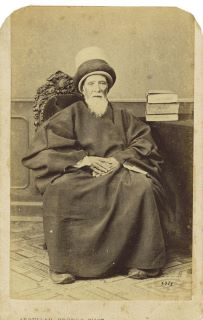
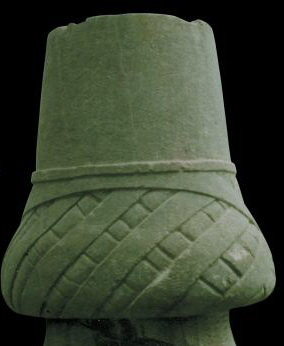

 (Tarihten İbretli Sayfalar)

Doğu ülkelerinde geziye çıkan bir Fransız mühendisin yolu 1867 yılının mayısında İstanbul’a düştü. Şehirden dolaşırken o sırada yoğun iş merkezi  Karaköy ve Galata rıhtımını bir eğlence merkezi olan Beyoğlu’na bağlayan Yüksek Kaldırım’dan günde yüzlerce kişinin inleye sıklaya yokuşu tırmanmaya çalıştığını gördü. Merdivenli sokağın başına oturdu ve bir gün boyu geçenleri saydı Tam 40 bin kişi.. Henri Gavan isimli Fransız mühendis buraya o çağda dünyada pek bilinmeyen  bir “Yer altı treni” yapmayı düşündü.

Gavan projelerini hazırladı ve Sultan Aziz döneminin Osmanlı Hükümeti’ne sundu. Gavan’ın planlarına göre buharlı bir makine ve bir kayışla yukarıya çekilecek trenin Beyoğlu’ndaki istasyonu Galata Mevlevîhânesi’nin mezarlığına rastlıyordu. Bu amaçla mezarlığın bir kısmının ortadan kalkması gerekiyordu. Hükümet’in adamları  “Biz bu işe karışmayız.. Şeyh Efendi’den izin alacaksın..” dediler.

Gavan, Galata Mevlevîhânesine gitti. Devrin şeyhinin karşısına çıktı. Derdini anlattı. Şeyh efendi şiddetle itiraz etti. Mevlevîhâne'nin mezarlığına Hükümet dahil kimse elini, süremezdi. Konuşma uzadıkça uzuyor, Şeyh Efendi inadından vaz geçmiyordu. Gavan ise şaşkındı, bir ara “Bunlar ölü, böyle hayırlı bir proje ölülere kurban edilir mi ?” dedi. Şeyh Efendi son noktayı koydu “ Bizim ölülerimiz sizin ölülerinizden daha diridir..”  Sonunda Efendi ikna edildi ve inşaata izin çıktı. O devirde Galata Mevlevîhânesi'nin kabristanı Şişhane'den Galatasaray ve  Kasımpaşa’ya kadar uzanıyordu. Bu gün o ulu mezarlıktan birkaç dönüm yer kalmıştır.

                                 
