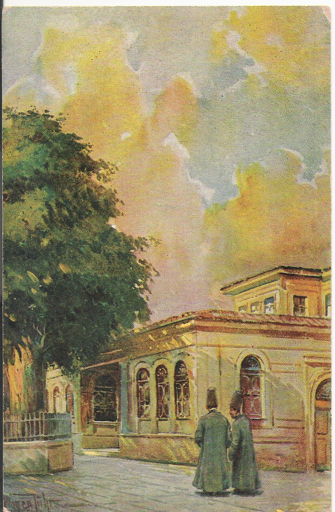
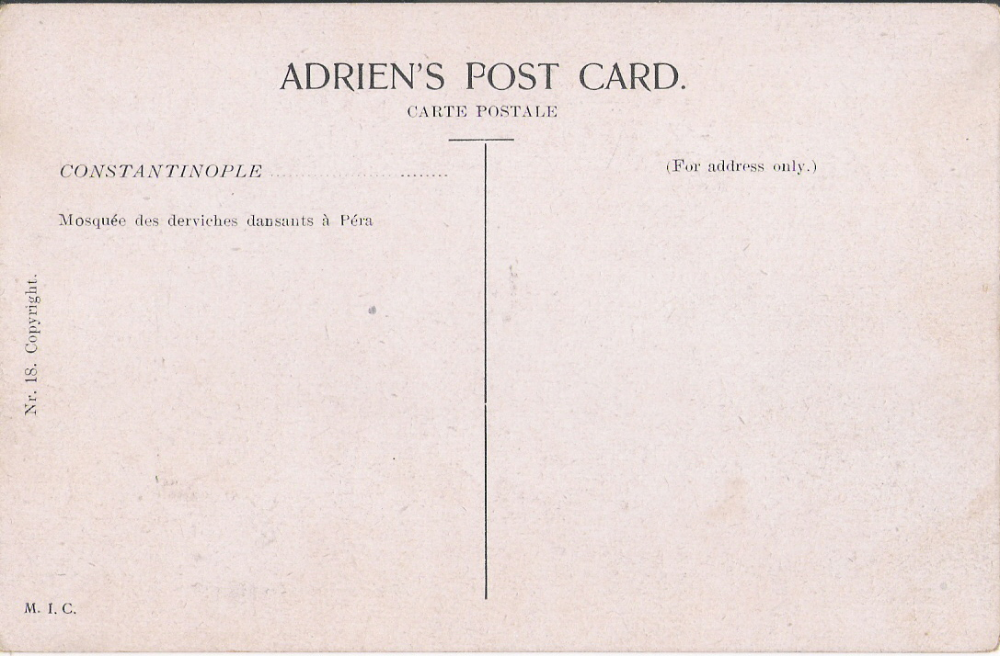

  [İki  yüz  yıl  önce  Galata  Mevlevîhânesi avlusunda iki Mevlevî Kartın  arkasında fransızca  "Mosquée  des derviches dansants à Péra, Beyoğlu' nda dans  eden  dervişler'in  camii " yazıyor. (Eski bir kartpostal'dan)](../uploads/2011/12/tekke1.jpg "tekke1.jpg")
