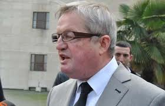
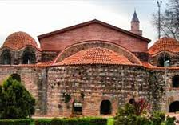

Osmanlı İmparatorluğu’nun temeli zamanımızdan yedi asır önce Batı Anadolu’da Söğüt’te atılmıştı. O çağda henüz Beylik olan bu devletin ikinci hükümdarı Orhan Gazi’dir. Orhan Gazi devleti gerçek anlamda örgütleyen ve Sultan ünvanını ilk defa kullanan Osmanlı Padişahı’dır.

Orhan gazi 1281 yılında Söğüt’te doğmuştu. 1326 yılında babası Osman Gazi’nin vefatı üzerine padişah oldu.1359’a kadar 33 yıl bu makamda kaldı. Devletin sınırlarını genişletti ve onu çağına göre modern bir devlet haline getirdi. Sultan Orhan’ın askerleri ele geçirdikleri şehirlerde halka karşı âdaletli davranıyorlardı.Bu yüzden ilk Osmanlı fetihleri sür’atle yayıldı.

Sultan Orhan 1326’da Bursa’ya girdi. 1329’da otuz yıldan fazla kuşatma altında bulunan İznik’in fethini tamamladı. 1360 yılında Gemlik’i ele geçirdi. Bizans’lılarla yapılan birkaç çatışma sonucu yaklaşık olarak tüm Batı Anadolu Osmanlı hükümdarlığı altına girmişti,

Sultan Orhan başarılı fetihler sonucunda “Şücaeddin” ünvanını almıştı. “Dinin kahramanı” anlamını taşıyan bu unvan, bölgede kurulan yeni siyasi oluşumun liderine uygun düşüyordu. O çağda Küçük Asya   büyük sıkıntılar ve tarifsiz siyasi çalkantılar içindeydi. Muazzam bir köylü ordusu kılığında 1. Haçlı seferi, ülkeyi Batı’dan doğuya yarmış, bunun hemen arkasından gelişen Moğol saldırısı Batı’dan gelen korkunç felaketin Doğu kanadını teşkil etmişti. Konya merkezli Anadolu Selçuk devleti dağılmış, Anadolu şehirleri anarşi içinde kalmıştı. Terör her ocağı yıkmış, ateş her bacayı sarmıştı.

Anadolu Selçuk devletinin son hükümdarı II. Gıyaseddin zamanı, hıristiyan Fransız paralı şövalyeleriyle desteklenen Konya’nın zalim askerleri, Malya Ovası katliamında 60 bin Türkmeni katletmişlerdi. Tarihte son savaşını kendi halkına karşı veren bu devlet, az sonra siyasi sahneden silinmişti.

Osman ve Orhan gazilerin devleti böyle bir enkazın üzerinde yükseliyordu. Canından bezmiş halkın güvenilir bir hukuk düzenine ihtiyacı vardı. Aksi halde dibe vuran yaşam sona ermek üzereydi. Yıkım ve esaret kaçınılmaz olmuştu. Bir devlet kurulmalı, bu devlet anarşiyi önlemeli, sağlam bir idari mekanizma, suç ve ceza dengesiyle disiplin sağlamalıydı. O çağda henüz güçlü kurumlara sahip olamayan kamu düzeni için tek çare dine bağlanmaktı. Orhan’ın “Şücaeddin” lakabı işte böyle bir ihtiyacı ifade ediyordu.

 Sultan Orhan İznik’i fethettikten az bir zaman sonra gelenek üzre şehrin ortasında yer alan büyük kiliseyi camiye çevirdi. Yanına bir de medrese inşa ettirdi. Hırıstiyan devrinde Ayasofya adı ile anılan bu kilisenin adı yine Ayasofya olarak kalmıştı. Kendilerinden ve tarihi misyonlarından emin olan fâtihler “devleti ebed müddet” kavramı içinde herhangi bir isim değişikliğine gerek duymamışlardı.

Sultan Orhan’ın camiye çevirdiği İznik Ayasofya’sının hırıstiyanlık tarihinde özel bir yeri vardır. Bu kilise miladî 325 tarihinde Roma kralı Konstantin’in arzusu ile toplanan ilk “itikat Meclisi”nin yapıldığı yerdir. Devrinde tüm din adamlarının bir araya gelerek temel itikat meselelerini konuştukları ve bir sonuca bağladıkları bu toplantılara hırıstiyan tarihinde “konsil” adı verilmektedir. 325 tarihli 1. İznik Konsil’ine o sırada Roma İmparatorluğu’nun egemenliği altında olan Avrupa, Afrika, Küçük Asya ve Mezopotamya’dan 200’e yakın piskopos iştirak etmişti.

Toplantıda konuşulan konu “Hz İsa Rûhullah aleyhisselam”ın  “ulûhiyeti”ydi. Erken hırıstiyan döneminde ilk hırıstiyan kaynakları, hz. İsa’nın kendisini "hem Allah, hem İnsan” olarak tanıttığını ileri sürüyordu. Buna göre dinin akaidinde Baba-Oğul-Ruhülkuds” kavramı geliştirilmişti. (Trinité) Baba ile oğul aynı cevherdendi. Hakk “baba” peygamber “oğul” ikisini bağlayan da “kutsal ruh” tu. Ancak bir zamandan beri Roma’nın bazı vilayetlerinde ve özellikle Mısır’da bu düşünceye bir isyan belirmişti.  Bazı kişiler “Baba” ile “oğul”un aynı cevherden olmadığını ileri sürüyorlardı Bu ekibin başını İskenderiye başpiskoposu “Ariüs” çekiyordu.

Ariüs ‘e göre  oğul Baba’nın yaratmasıydı.  Yani kendi ifadesi doğru olsa da Hz. İsa Allah değil, herkes gibi "Allah’ın yarattığı bir kuldu” ancak peygamberlikle görevlendirilmişti.

Peygamber Nâsıra’lı İsa’nın “Allahın oğlu  olduğuna dair geliştirilen “teslis:üçleme: trinité” kavramı Roma’nın resmi düşüncesiydi. O çağda putperest Tanrı inancından uzaklaşarak sarsıntı geçiren ve dağılmak üzere olan Roma, Hırıstiyanlığa ve tüm tek Tanrıcı dinlere özgürlük tanıyan 315 Milano Bildirisinden sonra bağlayıcı unsur olarak can havliyle hırıstiyanlığa sarılmıştı. Halbuki “kutsal teslise” saldıranlar yüzünden şimdi bu dinin birliği bozulmak üzereydi. Kral Kostantin 325 İznik konsilini bu yüzden topladı.

 İznik konsili aylar süren müzakerelerden sonra  “Baba “ ile “oğul”un aynı olduğunu ilan etti “Bu kararını “Homoousius” kelimesi ile tescil etti. İskenderiyeli yürekli Papaz yenilmişti. Yenilgisini hayatı ile ödedi.

İskenderiye’li papaz Ariüs’ün İsa Rûhullah aleyhisselam için geliştirerek “Thalia Ou le banquet spritiuel “ başlığı ile yazdığı bir kitapta savunduğu “Tanrı değil, peygamber" sav’ı İslamı düşünceye ve Kur’an hükümlerine uygundur. Teslis, kral  Kostantine ait bir siyasi programdı. Ariüs ise bir din adamıydı, kralın siyaseti onu ilgilendirmiyordu. Bu yüzden Ariüs’ü “gerçek bir İsevî-hırıstiyan” olarak selamlamak mümkündür. İznik Ayasofya’sında beş asır sonra bir Konsil daha yapılmış o sırada dini temellerinden sarsan “tasvir kırıcılık” konusu görülmüştü.

İznik Ayasofya’sının hırıstiyanlık tarihi içindeki yerini iyi bilen Vatikan’ın bu eser üzerindeki ilgisi hiç kesilmemiştir. Bölgede faaliyet gösteren Türk “turızm ve tanıtım” firmalarının  Ayasofya hakkında ürettikleri düşüncelerin de arkası kesilmemiştir. Buranın bir Sultan vakfı olduğunu bildikleri halde eserin hırıstiyan tarihi içindeki yerini ön plana alan turizmciler, “inanç turizmi” şeklinde tartışılmamış bir kavrama sarılarak fethi küçümsemekte ve Cami’nin yeniden kiliseye çevrilmesini arzu etmektedirler. Bir ara “Kültürel Miras” anlayışı ortaya çıkmış ve Osmanlı kültürel mirası ortada dururken Katolik kültürel mirasından söz edilmiştir.

Ortaya çıkan ilginç tartışmalar sırasında buranın yeniden “kilise” olmasını isteyenler görülmüş “yarısı cami, yarısı kilise olsun” diyenler çıkmıştır.  Olayı İspanya’daki Kurtuba Camii ile mukayese eden bazı kişiler, “reconquista” dan sonra Kral Karlos Kentos’un Kurtuba Camiinin ortasına katedral yapmak isteyenlere karşı “Bu ülkede pek çok katedral yapabilirsiniz ama bir Kurtuba Camii daha yapamazsınız” deyişini, İznik Ayasofyası’na giydirerek “İznik’te pek çok cami yapabilirsiniz ama bir Ayasofya daha yapamazsınız” şekline sokmuşlardır. Vakfın şartlarını yerine getirmekle görevli ve bu çaba içinde olan yöneticileri de “fetih edasıyla dinsel sömürü ve siyasi şov” yapmakla suçlamışlardır.

Ancak bu yoldaki çabalar sonuçsuz kalmıştır. Bununla birlikte 2000 yılında alınan geçici bir Hükümet kararı ile burada, Hz. İsa’nın 2000’inci doğum yılı münasebeti ile Vatikan tarafından yürütülen bir girişimle ayin yapılmıştı.

Orhan Gazi vakfı İznik Ayasofya’sı tüm Osmanlı asırları boyunca cami olarak kullanılmış, 90 yıl önce terkdilmişti. eser geçtiğimiz Kurban bayramında cami olarak hizmete açıldı. Bina Vakfın tarihi olan 1331’den bu yana geçen 680 yıllık İslamî yaşamına kaldığı yerden yeniden soyundu. Eskiler  “Şart-ı Vâkıf  Nâsı Şari gibidir” derlermiş, “Vakıf yapanın koyduğu kurallar Kur’an Hadis” hükmündedir, demektir. Böylece Orhan Gazinin 700 yıl önce kurduğu vakfın şartı da yerine gelmiş oldu. Tarihe ve ecdada karşı işlenmiş bir kusur ve bir ayıp temizlendi. 

                                                                                                                                                                              
