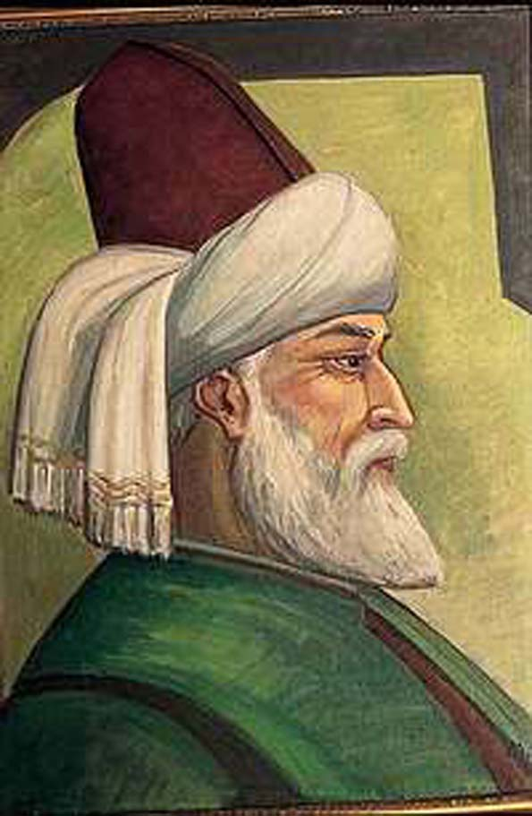

                    Mevlânâ ”gün ortasında hava karardı, güneşe bir şey mi oldu ?” dedi. Sonra anladı ; güneşte bir şey yok, kendi içi kararmış.                      Az daha güneşi suçlayacaktı...                      Kendini zor tuttu...                      Sonra Tanrısına şükretti.                      Kendi suçunu başkalarına yamayan insanlardan olmadığı için...                      O anda Güneşin ışıkları içine vurdu.                      Karanlıklar dağıldı.                      Sabah olmuş gibi.                      İçi serinledi Mevlânâ’nın                      Duru pınarlarda yıkanmış gibi.

                           Çok eskilerde bir Orta Asya şiiri diyor ki:

                                  Bütün canlı varlıklar                                   Karanlık tutkular yüzünden                                   Kabuk içinde dünyaya gelmiş gibi                                  Akılsız ve şuursuz bir haldeydiler

                      Bütün kötülükler işte o “karanlık tutkular” yüzünden çıkıyor.                       İnsan ruhunu kabuk içine sokan da onlardır.                        Vazgeçilmez “tutkular”                        Sanki  onlarla beraber doğmuşuz...                        Bizi “akılsız ve şuursuz” kılan tutkular.                                                       Dahası var...Biz bu karanlık tutkuları şimdilerde “yetenek” sanıyoruz. Hırsla,kibirle kabulleniyor,sahipleniyor ve onlardan “gurur” duyuyoruz. Onları paraya çevirenlerimiz de var.                         “Karanlık bir tutkuyu” meslek yapanlarımız çoğunlukta...                                 Ancak bu “karanlık tutkular” zevkli ve üretken görünse de içimizi öylesine acımasızca karartıyor ki, sıkıntılara düştüğümüzün sebebi onlar...                          Gün ortasında güneşin kararması işte o...                          Kahrolası bir kabuğun tam göbeğinde yaşayanlar, kendilerini “çağdaş medeniyetin” ilham  perileri yerine koyuyorlar. İğrenç bir savaşın en kızgın yerinde, soytarı varlıklarını, çok eski çağlarda yaşamış cihangir imparatorların kahraman askerleri gibi görüyorlar.                                                                 Başlarına gelen herşey kendi kusurlarındandır.                          Bir başka Orta Asya şiiri bunu daha da açık anlatıyor :

                               Başta kin olmak üzere her türlü fesat                                Ve pek çok sayısız tutkular                                Akıl ve şuurlarını şaşırtarak                                İnsanlara durmadan eziyet çektiriyordu.                                                     Şimdi konu Mevlânâ Hazretlerinin içine doğan güneş gibi aydınlık kazanıyor.  Derdin başı “akıl ve şuur” eksikliğidir. O da “kin ve fesat” yüzündendir.                           Büyük Yunus “Kini olanın dini yoktur” demiş.                           Dünyamızı karartmanın ve ruhumuzu cendereye sokmanın bir gereği varsa, buyurun kin ve fesat üretmeye devam edin.                           Bu bir pazarlıktır.                           İnsan olma veya olmama pazarlığı...                           Hak Yaradan cümle yaradılmışlara bu pazarlıktan kazançlı çıkmayı nasip buyursun.
