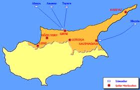

 Kıbrıs adası 1571’den beri kılıç hakkı, fetih toprağı şanlı Osmanlı ülkesinin 300 yıllık bir parçasıyken onu oradan söküp çıkaran 1800’lerde ülkemizde İngiltere’yi temsil eden  sir Henry Layard’dır.

Kendisinden önceki büyükelçi Lord Stratfort Canning’in yetiştirdiği başarılı diplomat Layard,  93 Harbi faciası ile uğraşan Osmanlı devlet adamlarını “Kıbrıs’ı verirseniz sizi Rusya’ya karşı koruruz” diyerek kandırmış ve Yeşil Ada yıllık 92.000 altına  Büyük Britanya imparatorluğuna kiralanmıştı.

Kıbrıs Adasının geçici olarak İngiltere’ye bırakılması konusunu görüşmek üzere devrin Osmanlı hükümeti İstanbul’da  70 kişilik bir “meclis-i Mahsusa” toplamıştı. Bu mecliste sürdürülen müzakereler sırasında Bursa delegesi Hasan Basri efendi şunları söyledi : “Menafi mevhume için zararı maktû ihtiyar olunamaz.” Siyasi tarihimize geçen bu cümlenin bu günkü şekli şudur : “hayalî bir çıkar için kesin bir zarar kabul olunamaz..”

Hoca efendi şunu demek istemişti “ kaz gelecek yerden tavuk esirgenmez ama eldeki tavuk da geleceği kuşkulu kazdan iyidir” Ve Hoca’nın dediği çıktı. İngilizler vaadlerinde durmadılar, Rusların İstanbul kapılarına kadar ilerleyişlerine engel olamadılar. Kaz uçmuş tavuk da elden çıkmıştı.

Kıbrıs’ta İngiliz geçici hakimiyeti Birinci Dünya Savaşına kadar devam etti. 1914’de başlayan bu savaşta Osmanlı Devleti İngiltere ile karşı karşıya geldiği için İngilizler Adayı ilhak ettiler. Adadaki İngiliz egemenliği tarih farkıyla 93 harbi olarak adlandırılan 1877 Türk-Rus savaşı’ndan 1914’e kadar 37 yıl sürmüştür. Merak ediyorum acaba İngiliz hükümeti  bu 37 yıl içinde Ada’nın 92 bin altın değerindeki kira parasını muntazam ödedi mi ? Yoksa o paralar  kasada mı kaldı ?

Çanakkale savaşı sırasında İngiliz ordusu donanmanın üslendiği Gökçe Ada ile savaş bölgeleri arasında deniz altından bir telgraf hattı kurmuştu. Ankara’da Cumhuriyet kurulduğunda Türk hükümeti artık kullanılmayan bu hattı para ile satın aldı. Ankara hükümetinin gösterdiği bu ahlaki davranışı acaba İngiliz hükümeti de göstererek bize o 37 yılın hesabını çıkarabilir mi ? Kira ödenmedi ise şimdi ödemeyi düşünür mü ?

Osmanlı devletinin işlediği farzedilen sözde bir  “soykırım “ faciasını Cumhuriyet hükümetine fatura eden Batılı dostlarımızın da Osmanlıya olan taahütlerini Cumhuriyete ödemeleri gerekmiyor mu ?  Aksi halde Büyük Britanya Devleti kiraladığı eve el koyan bir hırsız durumuna düşmüyor mu ?

Kıbrıs’ı çoran edip İngiltere’ye hediye eden sir Henry Layard aynı zamanda uluslar arası bir eski eser kaçakçısıdır. İstanbul’da Sahaflar çarşısında bulduğu eski bir yağlıboya resmi satın alarak yasa dışı yollardan ülkesine kaçıran adamdır. O resim bu gün Londra’da “National Gallery”de ressam “Gentil Bellini” salonunda bir duvarı süslüyor: Sultan Fatih’in ünlü tablosu.. Topkapı Sarayı’nda bulunması gereken bu resmin, İngiltere’ye taşınması önemli bir diplomatik olaydır.

Koca bir adayı kaçırıp götüren başarılı diplomat Layard için yağlıboya bir resmi kaçırmak herhalde zor olmamıştır. 1835’te Yunan krallığının kurulmasına ön ayak olan Layard’ın ustası Canning de, ada falan değil, koca bir ülkeyi kaçırmış ve sözlüğüne şunları yazmıştı “ Dağılmak üzere olan bu imparatorluk bu gün için yamalı bir boğçadır, isteyen istediği yerini rahatça koparabilir..” 

İngiltere’ye “büyük” lakabını acaba kim taktı ?   kirasını ödemeyen, oturduğu yere el koyan, ülke soyucu, vatan dağıtıcı, medeniyet kırıcı İngiltere'nin  acaba neresi “büyüktür”
